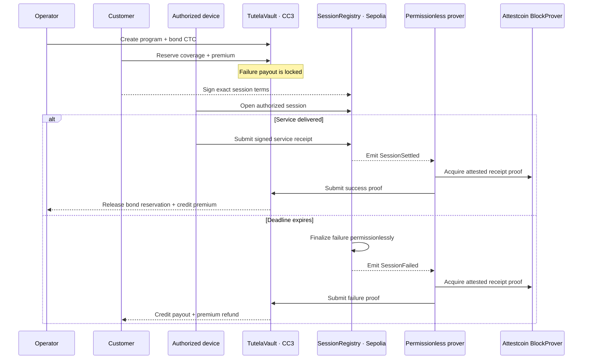

<p align="center">
  
</p>

<h1 align="center">Tutela</h1>
<p align="center"><strong>Proof-settled service warranties for DePIN.</strong></p>
<p align="center">Lock collateral before service. Settle from verified delivery. Pay failure without discretion.</p>

<p align="center">
  <a href="#verified-testnet-settlements">Verified settlements</a> ·
  <a href="#protocol-architecture">Architecture</a> ·
  <a href="#trust-model">Trust model</a> ·
  <a href="#engineering-assurance">Verification</a> ·
  <a href="SECURITY.md">Security</a>
</p>

---

Most DePIN service agreements stop where enforcement begins. Delivery is measured off-chain, collateral lives elsewhere, and a failed promise still depends on an operator, oracle, or multisig deciding what happens next.

Tutela replaces that discretionary step with a narrow protocol rule: an operator bonds native CTC against immutable service terms before a session begins; a source-chain outcome is proven through Attestcoin; Creditcoin CC3 releases the premium when service is delivered or credits the customer when it is not.

No trusted relayer decides the result. No general-purpose cross-chain message can move the vault. The submitted proof must match the exact registry, lifecycle event, identities, terms, deadline, and service units committed when coverage was reserved.

## Release posture

| Property              | Current release                                                                |
| --------------------- | ------------------------------------------------------------------------------ |
| Assurance             | Native CTC collateral reserved before service                                  |
| Source authority      | EIP-712-authorized service sessions on Ethereum Sepolia                        |
| Settlement            | Attestcoin-verified transaction receipts on Creditcoin CC3                     |
| Prover                | Permissionless, retryable, and untrusted                                       |
| Published evidence    | One successful lifecycle and one compensated failure lifecycle                 |
| Deployment provenance | Git revision, creation input, constructor arguments, runtime, and verifier     |
| Read model            | Static, validated evidence snapshots with direct explorer links                |
| Scope                 | Public testnet prototype; non-upgradeable contracts; not independently audited |

## Verified testnet settlements

Tutela ships with both terminal branches completed on public testnets. The records below are not illustrative UI data: the release validator replays their receipts and historical contract state against Sepolia and CC3 RPCs.

| Outcome         | Sepolia authority                                                                                                                          | Creditcoin settlement                                                                                                                                  | Result                                                                   |
| --------------- | ------------------------------------------------------------------------------------------------------------------------------------------ | ------------------------------------------------------------------------------------------------------------------------------------------------------ | ------------------------------------------------------------------------ |
| **Succeeded**   | [`0x660700…6f36`](https://sepolia.etherscan.io/tx/0x660700a12e7c94f1acf0439157beeb6ba1cd935aade75ef6ab7ec3ecc9216f36) · block `11,575,967` | [`0x12b3d8…f12b`](https://creditcoin-testnet.blockscout.com/tx/0x12b3d8a3d7c666aca28631d3d594443389e69ae15b563f14c916e390242bf12b) · block `5,381,500` | `1` unit delivered; `0.001 CTC` premium credited; reserved bond released |
| **Compensated** | [`0xb34a32…505d`](https://sepolia.etherscan.io/tx/0xb34a32183024e6a7d5276c5b74227343b937ac396a4b55ca23fdbac8e746505d) · block `11,576,105` | [`0xde0669…cf01`](https://creditcoin-testnet.blockscout.com/tx/0xde066947de440ac2eb140ebf65fe37b459e781eb646012ec74fda60314c7cf01) · block `5,381,614` | `0.01 CTC` bond consumed; `0.011 CTC` total credited (payout + refund)   |

### Evidence identity

| Record                     | Identifier                                                           |
| -------------------------- | -------------------------------------------------------------------- |
| Program                    | `0x88c009c1caeaa9b2889593791115138e662f8d6e3e6dea58ff03491037187f07` |
| Successful coverage        | `0x60cf6800840d779b92454f6358445bfe66825cc0af748e562accf5276c30444c` |
| Compensated coverage       | `0xd1c9c247c2aab9ef519b2cceec8ac36121bee6e66e1f8a0d73542b34b18a59ef` |
| Deployed protocol revision | `2f86d9637bdae625af813159d288422a0154900c`                           |

Public receipt routes:

```text
/receipt/0x60cf6800840d779b92454f6358445bfe66825cc0af748e562accf5276c30444c
/receipt/0xd1c9c247c2aab9ef519b2cceec8ac36121bee6e66e1f8a0d73542b34b18a59ef
```

The evidence app is intentionally a validated snapshot, not a live indexer. It fails closed when a verified manifest is absent and never fabricates pending identifiers, balances, or transactions.

## Settlement model

Tutela has two terminal outcomes and one settlement policy.

### Service delivered

1. The customer reserves coverage and pays the program premium on CC3.
2. The customer authorizes exact session terms with EIP-712.
3. The authorized device opens and settles the session on Sepolia.
4. A permissionless worker obtains the Attestcoin proof and submits it to CC3.
5. The vault verifies the source event, releases reserved collateral, and credits the operator premium.

### Service missed

1. Coverage and source session are opened against the same committed terms.
2. The deadline expires without a valid service receipt.
3. Anyone may finalize the failed source session on Sepolia.
4. A permissionless worker proves that failure event on CC3.
5. The vault consumes the reserved payout and credits the customer with payout plus premium refund.

The customer never relies on a worker to interpret service quality. Workers transport proof; the contracts determine whether that proof authorizes a specific transition.

## Protocol architecture



### Components

| Layer                    | Responsibility                                                                                         |
| ------------------------ | ------------------------------------------------------------------------------------------------------ |
| `ServiceSessionRegistry` | Customer authorization, device-bound opening, signed completion, and deterministic expiry              |
| `TutelaVault`            | Program terms, native CTC collateral, payout reservation, proof semantics, and pull-payment settlement |
| Permissionless prover    | Source indexing, durable queueing, proof acquisition, preflight simulation, retry, and CC3 submission  |
| Protocol package         | Shared ABIs, schemas, chain constants, and deployment/evidence types                                   |
| Evidence application     | Manifest-backed coverage views, public receipts, and wallet-aware CC3 program creation                 |

The contracts are deliberately non-upgradeable. There is no proxy administrator, trusted relay role, arbitrary cross-chain executor, protocol token, DAO vote, or AI adjudicator in the settlement path.

## Trust model

Tutela separates proof transport from settlement authority.

### What Attestcoin proves

A specific source transaction and receipt were included for the configured source chain and block.

### What Tutela enforces

`TutelaVault.submitProof` accepts that receipt only when all protocol commitments match:

- authoritative Sepolia chain key `1` from CC3 `ChainInfo`;
- successful, zero-value source transaction;
- approved registry as transaction target and event emitter;
- exactly one expected lifecycle event;
- matching program, coverage, session, and proof identifiers;
- customer, operator, authorized-device, and registry identities;
- committed terms hash, deadline, premium, payout, and minimum units;
- sufficient delivered units for success;
- valid lifecycle state and unused proof.

A prover may delay, retry, disappear, or submit invalid data. It cannot grant itself authority or redirect value.

### What remains outside the proof

The authorized device attests the physical service measurement. An EVM receipt cannot independently prove electricity, bandwidth, storage, or compute delivery. Production use therefore requires secure device keys and a hardware trust model beyond this prototype.

For the published testnet run, customer, operator, and device roles use one dedicated account to reduce operational friction. The contract roles and signatures remain distinct, and adversarial tests exercise those boundaries, but this evidence does not demonstrate independent custody. See [`SECURITY.md`](SECURITY.md) for the complete model.

> **Testnet only.** Tutela has not received an independent security audit and must not custody production value.

## Contract deployments

| Network                       | Contract                 | Address                                                                                                       | Deployment                                                                                                                                         |
| ----------------------------- | ------------------------ | ------------------------------------------------------------------------------------------------------------- | -------------------------------------------------------------------------------------------------------------------------------------------------- |
| Ethereum Sepolia · `11155111` | `ServiceSessionRegistry` | [`0x6ecA…4577`](https://sepolia.etherscan.io/address/0x6ecA894E12cE5d498e9b55fD4cFc246995494577)              | [transaction](https://sepolia.etherscan.io/tx/0xaee94c1d92b383de27fb22ccde9d59a94d0adbb9dc22b86e4545a26cbc544dcf) · block `11,575,353`             |
| Creditcoin CC3 · `102031`     | `TutelaVault`            | [`0x6ecA…4577`](https://creditcoin-testnet.blockscout.com/address/0x6ecA894E12cE5d498e9b55fD4cFc246995494577) | [transaction](https://creditcoin-testnet.blockscout.com/tx/0x5e158d6be28f2b20aa532fe2d1ff10a779323efae647bdf2aa11cdb6a1622dd1) · block `5,380,994` |

### Creditcoin infrastructure

| Component      | Address                                      |
| -------------- | -------------------------------------------- |
| `ChainInfo`    | `0x0000000000000000000000000000000000000fd3` |
| `BlockProver`  | `0x0000000000000000000000000000000000000FD2` |
| `EvmV1Decoder` | `0x731c345d79Fb8BbDC541f9DF3b6317585F849F9f` |

The deployment validator binds each manifest to the named Git revision, reconstructed creation bytecode, constructor arguments, successful creation receipt, deployed runtime hash, and canonical CC3 verifier.

## Engineering assurance

The repository uses one release gate:

```bash
pnpm verify
```

It covers:

| Area                  | Release check                                                                                        |
| --------------------- | ---------------------------------------------------------------------------------------------------- |
| Formatting            | Prettier and Forge format checks                                                                     |
| Type safety           | Strict TypeScript checks across protocol, prover, and web                                            |
| Application behavior  | 13 tests: 4 prover tests and 9 evidence/UI tests                                                     |
| Contract behavior     | 23 Foundry tests, including adversarial paths                                                        |
| Property testing      | 1,000 fuzz runs and 32,768 invariant calls                                                           |
| Production output     | Protocol, prover, and optimized web builds; route/vendor splitting; no public source maps            |
| Contract limits       | Runtime-size checks with explicit EIP-170 margin                                                     |
| Deployment provenance | Source revision, creation input, constructor, receipt, runtime hash, and verifier                    |
| Settlement evidence   | Live receipts, historical state, Attestcoin metadata, exact events, proof IDs, and balance equations |

### Contract size

| Contract                 | Runtime size | EIP-170 margin |
| ------------------------ | -----------: | -------------: |
| `ServiceSessionRegistry` |  6,026 bytes |   18,550 bytes |
| `TutelaVault`            | 14,448 bytes |   10,128 bytes |

GitHub and production builds run the same gate with pinned Node, pnpm, Foundry, and forge-std versions.

## Local development

### Requirements

- Node.js `24+`
- pnpm `11.20.0`
- Foundry `1.7.1` for contract commands

```bash
pnpm install --frozen-lockfile
pnpm verify
pnpm dev
```

Primary routes:

| Route                   | Purpose                                                 |
| ----------------------- | ------------------------------------------------------- |
| `/`                     | Protocol overview and direct links to verified outcomes |
| `/app`                  | Evidence dashboard and program workspace                |
| `/app/coverage`         | Successful and compensated coverage records             |
| `/receipt/<coverageId>` | Public, explorer-backed settlement receipt              |
| `/programs/new`         | Wallet-aware Creditcoin CC3 program creation            |

Program creation is a real CC3 write flow. A new write does not appear in the evidence views until its lifecycle is captured in a manifest and passes validation.

## Prover and lifecycle operation

The prover supports encrypted Foundry keystores for interactive signing. A raw private key remains optional only for controlled headless environments.

```bash
cp .env.example apps/prover/.env
pnpm --filter @tutela/prover start -- --once
```

Set `CC3_KEYSTORE_PATH` to the encrypted keystore path and enter its password only through the local hidden prompt. Never commit or paste a phrase, private key, keystore password, or populated `.env` file.

The lifecycle runner performs a read-only preflight unless reservation is explicitly authorized. It validates chain IDs, deployed code, program terms, collateral, and conservative gas budgets before spending.

```powershell
.\scripts\live-lifecycle.ps1 -Outcome success
.\scripts\live-lifecycle.ps1 -Outcome success -ConfirmReservation
```

After reservation, the runner checkpoints public lifecycle identifiers under ignored `.data/` state. If execution stops, it reads the current coverage state and prints the appropriate cancellation, settlement, expiry, or prover-resume path. Signing secrets are never written.

The prover's durable queue also lives under `.data/`. Structured logs redact transaction, coverage, and session identifiers by default.

## Repository layout

```text
apps/
  prover/                 permissionless proof worker and durable queue
  web/                    evidence application, public receipts, and CC3 write flow
contracts/
  src/source/             Sepolia session authority
  src/cc3/                Creditcoin collateral and settlement vault
  test/                   unit, adversarial, fuzz, and invariant coverage
packages/protocol/        shared ABIs, constants, schemas, and types
deployments/              explorer-backed deployment manifests
evidence/                 verified success and failure lifecycle manifests
scripts/                  Foundry wrapper, lifecycle runner, and live validators
```

## Evidence discipline

Evidence manifests have two strict states:

- `pending` contains only schema version, status, and outcome;
- `verified` requires complete source and destination records, semantics, balance effects, and deployed contract references.

The validators additionally require exact explorer hosts and transaction hashes, matching protocol revisions, successful receipts, historical program and coverage state, canonical Attestcoin metadata, and exact economic equations. Success must meet minimum units without consuming operator bond. Failure must consume the committed payout and credit payout plus premium refund.

This makes the README and application downstream of public, machine-checked facts rather than manually maintained demo claims.

## License

[MIT](LICENSE) · Built for BUIDL CTC 2026.
