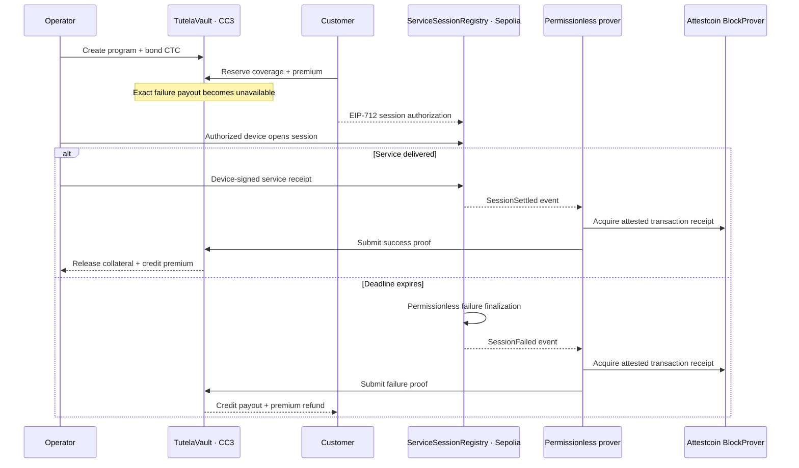

<p align="center">
  
</p>

<h1 align="center">Tutela</h1>
<p align="center"><strong>Service proved. Failure paid.</strong></p>
<p align="center">A proof-settled, collateralized warranty primitive for DePIN services.</p>

<p align="center">
  <a href="https://github.com/dexarxbt/Tutela/actions/workflows/verify.yml"></a>
  <a href="LICENSE"></a>
  
  
</p>

---

A DePIN service promise is only useful when breaking it has a deterministic economic consequence. Tutela lets an operator bond native CTC against immutable service terms before a customer starts a session. A verified source-chain outcome then releases the premium on success or credits the reserved payout and premium refund on failure.

Tutela uses [Attestcoin](https://docs.creditcoin.org/creditcoin-usc) to transport Sepolia transaction receipts into Creditcoin CC3. The prover is permissionless and untrusted: only exact contract semantics can authorize a vault transition.

## Live testnet proof

The repository includes two completed Sepolia → Creditcoin CC3 lifecycles. Every identifier, transaction, semantic field, and balance effect below is validated from `evidence/*.json` and rendered by the public receipt UI.

| Outcome     | Source evidence                                                                                                                                      | CC3 settlement                                                                                                                                               | Economic result                                                                          |
| ----------- | ---------------------------------------------------------------------------------------------------------------------------------------------------- | ------------------------------------------------------------------------------------------------------------------------------------------------------------ | ---------------------------------------------------------------------------------------- |
| **Success** | [Sepolia tx `0x660700…6f36`](https://sepolia.etherscan.io/tx/0x660700a12e7c94f1acf0439157beeb6ba1cd935aade75ef6ab7ec3ecc9216f36), block `11,575,967` | [CC3 tx `0x12b3d8…f12b`](https://creditcoin-testnet.blockscout.com/tx/0x12b3d8a3d7c666aca28631d3d594443389e69ae15b563f14c916e390242bf12b), block `5,381,500` | `1` unit met the `1`-unit minimum; `0.001 CTC` premium credited; operator bond unchanged |
| **Failure** | [Sepolia tx `0xb34a32…505d`](https://sepolia.etherscan.io/tx/0xb34a32183024e6a7d5276c5b74227343b937ac396a4b55ca23fdbac8e746505d), block `11,576,105` | [CC3 tx `0xde0669…cf01`](https://creditcoin-testnet.blockscout.com/tx/0xde066947de440ac2eb140ebf65fe37b459e781eb646012ec74fda60314c7cf01), block `5,381,614` | `0.01 CTC` bond consumed; `0.011 CTC` payout plus premium refund credited                |

**Program:** `0x88c009c1caeaa9b2889593791115138e662f8d6e3e6dea58ff03491037187f07`

**Verified coverage receipts:**

- success — `/receipt/0x60cf6800840d779b92454f6358445bfe66825cc0af748e562accf5276c30444c`
- failure — `/receipt/0xd1c9c247c2aab9ef519b2cceec8ac36121bee6e66e1f8a0d73542b34b18a59ef`

The web app is an explorer-backed evidence snapshot, not a live indexer. It fails closed when verified manifests are unavailable and never invents missing state.

## How it works



### The critical design rule

A valid cross-chain proof is **transport**, not authority. `TutelaVault.submitProof` accepts a transition only after checking:

- authoritative Sepolia chain key `1` from CC3 `ChainInfo`;
- successful, zero-value source transaction;
- approved registry as transaction target and event emitter;
- exactly one expected lifecycle event;
- matching program, coverage, and session identifiers;
- customer, operator, and authorized-device identities;
- terms hash, deadline, and minimum service units;
- delivered units for a successful session;
- proof replay and lifecycle state.

The prover can retry, disappear, or submit invalid data. It cannot bypass these checks or move value by privilege.

## Deployed contracts

| Network                       | Contract                 | Address                                                                                                       | Deployment                                                                                                                               |
| ----------------------------- | ------------------------ | ------------------------------------------------------------------------------------------------------------- | ---------------------------------------------------------------------------------------------------------------------------------------- |
| Ethereum Sepolia · `11155111` | `ServiceSessionRegistry` | [`0x6ecA…4577`](https://sepolia.etherscan.io/address/0x6ecA894E12cE5d498e9b55fD4cFc246995494577)              | [tx](https://sepolia.etherscan.io/tx/0xaee94c1d92b383de27fb22ccde9d59a94d0adbb9dc22b86e4545a26cbc544dcf), block `11,575,353`             |
| Creditcoin CC3 · `102031`     | `TutelaVault`            | [`0x6ecA…4577`](https://creditcoin-testnet.blockscout.com/address/0x6ecA894E12cE5d498e9b55fD4cFc246995494577) | [tx](https://creditcoin-testnet.blockscout.com/tx/0x5e158d6be28f2b20aa532fe2d1ff10a779323efae647bdf2aa11cdb6a1622dd1), block `5,380,994` |

CC3 infrastructure used by the deployed vault:

| Component      | Address                                      |
| -------------- | -------------------------------------------- |
| `ChainInfo`    | `0x0000000000000000000000000000000000000fd3` |
| `BlockProver`  | `0x0000000000000000000000000000000000000FD2` |
| `EvmV1Decoder` | `0x731c345d79Fb8BbDC541f9DF3b6317585F849F9f` |

Deployment records include bytecode hashes, constructor arguments, blocks, deployer, and explorer transactions in `deployments/*.json`.

## System architecture

| Layer                    | Responsibility                                                                                          |
| ------------------------ | ------------------------------------------------------------------------------------------------------- |
| `ServiceSessionRegistry` | EIP-712 customer authorization, device-bound session opening, signed completion, deterministic expiry   |
| `TutelaVault`            | Immutable programs, native CTC collateral, reservation, strict proof semantics, pull-payment settlement |
| Permissionless prover    | Source indexing, durable queue, ChainInfo lookup, proof acquisition, preflight, retry, submission       |
| Protocol package         | Shared ABIs, schemas, chain constants, and deployment/evidence types                                    |
| Evidence app             | Verified manifest adapter, explorer-backed receipts, wallet-aware CC3 program creation                  |

The contracts are deliberately non-upgradeable. There is no proxy admin, trusted relayer role, arbitrary cross-chain executor, token, DAO, or AI adjudicator.

## Security and truth boundary

**Attestcoin proves** that a specific source transaction and receipt were included for the configured chain.

**Tutela enforces** which registry, event, identities, terms, deadline, and service units may move collateral.

**The authorized device still attests** the physical measurement. A transaction receipt cannot independently prove electricity, bandwidth, storage, or compute delivery. Production use requires secure device keys and a hardware trust model outside this prototype.

The published demo aliases customer, operator, and device to one dedicated testnet account to minimize operational friction. Contract roles and signatures remain distinct, and adversarial tests exercise separation, but the evidence does not demonstrate independent custody. See [`SECURITY.md`](SECURITY.md) for the full model and limitations.

> **Testnet only.** Tutela has not received an independent audit and must not custody production value.

## Verification

The complete acceptance gate is one command:

```bash
pnpm verify
```

It runs:

- Prettier and Forge formatting checks;
- strict TypeScript checks across protocol, prover, and web;
- **13 application tests** — 4 prover tests and 9 evidence/UI tests;
- production builds with route/vendor splitting and no public source maps;
- contract size checks;
- **23 Foundry tests**;
- **1,000 fuzz runs**;
- **32,768 invariant calls**;
- deployment manifests checked against the named Git revision, exact creation bytecode and constructor arguments, live creation receipts, runtime bytecode hashes, and configured on-chain infrastructure;
- verified evidence checked against live RPC receipts, historical state, exact event semantics, balance equations, and explorer URLs.

Current contract sizes:

| Contract                 | Runtime size | EIP-170 margin |
| ------------------------ | -----------: | -------------: |
| `ServiceSessionRegistry` |  6,026 bytes |   18,550 bytes |
| `TutelaVault`            | 14,448 bytes |   10,128 bytes |

## Run locally

### Requirements

- Node.js `24+`
- pnpm `11.20.0`
- Foundry `1.7.1` for contract commands

```bash
pnpm install --frozen-lockfile
pnpm verify
pnpm dev
```

Open:

- `/` — protocol narrative and verified outcome links
- `/app` — evidence dashboard and program workspace
- `/app/coverage` — both verified lifecycle snapshots
- `/receipt/<coverageId>` — public explorer-backed receipt

The program creation route is a real Creditcoin CC3 write flow. New writes do not appear in evidence views until a new manifest is captured and validated.

## Prover operation

The prover supports an encrypted Foundry keystore for interactive signing. Raw private keys remain optional only for controlled headless environments.

```bash
cp .env.example apps/prover/.env
pnpm --filter @tutela/prover start -- --once
```

Set `CC3_KEYSTORE_PATH` to the encrypted keystore path. Enter its password only in the local hidden prompt. Never commit or paste a phrase, private key, keystore password, or populated `.env` file.

The source lifecycle runner is read-only unless reservation is explicitly confirmed. It verifies both chain IDs, deployed code, program terms, collateral, and wallet gas balances before spending:

```powershell
.\scripts\live-lifecycle.ps1 -Outcome success
.\scripts\live-lifecycle.ps1 -Outcome success -ConfirmReservation
```

After reservation it checkpoints public identifiers under ignored `.data/` state and emits state-aware Reserved or Active recovery commands if execution stops. It never writes signing secrets.

The durable queue lives under `.data/` and is ignored by Git. Structured logs redact source, destination, coverage, and session transaction identifiers by default.

## Repository map

```text
apps/
  prover/                 permissionless proof worker and durable queue
  web/                    evidence app, public receipts, and wallet write flow
contracts/
  src/source/             Sepolia session authority
  src/cc3/                Creditcoin collateral and settlement vault
  test/                   unit, adversarial, fuzz, and invariant coverage
packages/protocol/        shared ABIs, constants, schemas, and types
deployments/              confirmed explorer-backed deployment manifests
evidence/                 verified success and failure lifecycle manifests
scripts/                  Foundry wrapper, lifecycle runner, and validators
```

## Evidence integrity

`pending` and `verified` are strict manifest states:

- pending evidence may contain only schema version, status, and outcome;
- verified evidence requires complete source/destination records, committed semantics, balance effects, and deployed contract references;
- explorer URLs must exactly match the expected HTTPS host and transaction hash;
- success must meet minimum units without consuming bond;
- failure must consume bond and increase customer claimable balance;
- role aliasing is handled explicitly rather than hiding the operator premium as customer compensation.

This keeps the UI and README downstream of validated public facts.

## License

[MIT](LICENSE) · Built for BUIDL CTC 2026.
