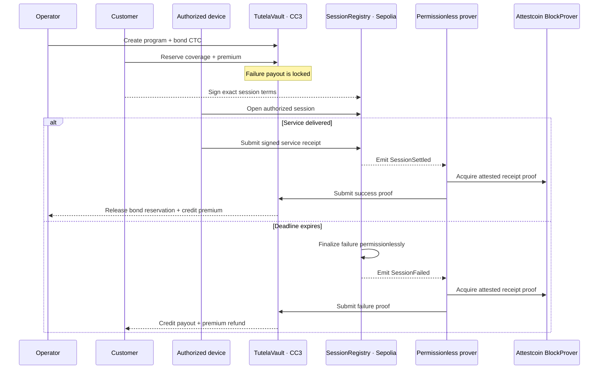

<p align="center">
  
</p>

<h1 align="center">Tutela</h1>
<p align="center"><strong>Proof-settled service warranties for DePIN.</strong></p>
<p align="center">Lock collateral before service. Settle from verified delivery. Pay failure without discretion.</p>
<p align="center">
  <strong><a href="https://tutela-ctc.vercel.app/">Launch the deployed Tutela application</a></strong>
</p>

<p align="center">
  <a href="#live-application">Live application</a> ·
  <a href="#public-testnet-evidence">Evidence</a> ·
  <a href="#zero-spend-local-demo">Local demo</a> ·
  <a href="#protocol-architecture">Architecture</a> ·
  <a href="#verification">Verification</a> ·
  <a href="SECURITY.md">Security</a>
</p>

---

Tutela is a public-testnet prototype for collateral-backed service guarantees. An operator bonds native CTC against immutable service terms before a session begins. A source-chain outcome is proven through Attestcoin, and the Creditcoin CC3 vault releases the premium when service is delivered or compensates the customer when it is not.

The prover transports evidence but does not decide the result. `TutelaVault` accepts only proofs from the configured registry whose chain, event, identities, terms, deadline, and service units match the coverage reserved on CC3.

## Live application

**Deployed app:** [https://tutela-ctc.vercel.app/](https://tutela-ctc.vercel.app/)

The hosted application presents the repository's validated public-testnet evidence. These routes are useful for review; replace the hosted origin with `http://localhost:5173` when running locally.

| Route                                                                                                                              | Purpose                                     |
| ---------------------------------------------------------------------------------------------------------------------------------- | ------------------------------------------- |
| [`/`](https://tutela-ctc.vercel.app/)                                                                                              | Protocol overview and release evidence      |
| [`/app`](https://tutela-ctc.vercel.app/app)                                                                                        | Evidence dashboard                          |
| [`/app/programs`](https://tutela-ctc.vercel.app/app/programs)                                                                      | Published program snapshot                  |
| [`/app/coverage`](https://tutela-ctc.vercel.app/app/coverage)                                                                      | Successful and compensated coverage records |
| [`/app/activity`](https://tutela-ctc.vercel.app/app/activity)                                                                      | Terminal settlement activity                |
| [`/receipt/0x60cf…044c`](https://tutela-ctc.vercel.app/receipt/0x60cf6800840d779b92454f6358445bfe66825cc0af748e562accf5276c30444c) | Successful coverage receipt                 |
| [`/receipt/0xd1c9…59ef`](https://tutela-ctc.vercel.app/receipt/0xd1c9c247c2aab9ef519b2cceec8ac36121bee6e66e1f8a0d73542b34b18a59ef) | Compensated-failure receipt                 |

Viewing the hosted app or the local evidence routes is zero-spend and requires no wallet. The following are operational or value-bearing actions:

| Action                                             | Signing and spend boundary                                                                 |
| -------------------------------------------------- | ------------------------------------------------------------------------------------------ |
| `/app/programs/new`                                | Connects a wallet and submits a CC3 `createProgram` transaction with a native CTC bond     |
| Prover commands                                    | Load a signer and can submit CC3 proof-settlement transactions, including in `--once` mode |
| `live-lifecycle.ps1` without `-ConfirmReservation` | Read-only                                                                                  |
| `live-lifecycle.ps1` with `-ConfirmReservation`    | Spends testnet funds and may continue through additional lifecycle transactions            |

## Release summary

| Property               | Current release                                                                             |
| ---------------------- | ------------------------------------------------------------------------------------------- |
| Assurance              | Native CTC collateral reserved before service                                               |
| Source authority       | EIP-712-authorized sessions on Ethereum Sepolia                                             |
| Settlement             | Attestcoin-verified receipts on Creditcoin CC3                                              |
| Published outcomes     | One successful lifecycle and one compensated failure                                        |
| Public transaction set | Six explorer-backed transactions: two deployments and four terminal settlement transactions |
| Read model             | Validated static evidence manifests with direct explorer links                              |
| Scope                  | Public testnet prototype; non-upgradeable contracts; not independently audited              |

## Public testnet evidence

The repository publishes exactly six release transaction hashes. Deployment validation checks both contract creations, and evidence validation cross-checks both terminal outcomes against live RPC receipts and historical contract state.

### Contract deployments

| Network                       | Contract                 | Transaction                                                                                                                        |        Block |
| ----------------------------- | ------------------------ | ---------------------------------------------------------------------------------------------------------------------------------- | -----------: |
| Ethereum Sepolia · `11155111` | `ServiceSessionRegistry` | [`0xaee94c…4dcf`](https://sepolia.etherscan.io/tx/0xaee94c1d92b383de27fb22ccde9d59a94d0adbb9dc22b86e4545a26cbc544dcf)              | `11,575,353` |
| Creditcoin CC3 · `102031`     | `TutelaVault`            | [`0x5e158d…2dd1`](https://creditcoin-testnet.blockscout.com/tx/0x5e158d6be28f2b20aa532fe2d1ff10a779323efae647bdf2aa11cdb6a1622dd1) |  `5,380,994` |

Both contracts are deployed at `0x6ecA894E12cE5d498e9b55fD4cFc246995494577` on their respective networks.

### Terminal outcomes

| Outcome         | Sepolia authority                                                                                                                          | CC3 proof settlement                                                                                                                                   | Result                                                                   |
| --------------- | ------------------------------------------------------------------------------------------------------------------------------------------ | ------------------------------------------------------------------------------------------------------------------------------------------------------ | ------------------------------------------------------------------------ |
| **Succeeded**   | [`0x660700…6f36`](https://sepolia.etherscan.io/tx/0x660700a12e7c94f1acf0439157beeb6ba1cd935aade75ef6ab7ec3ecc9216f36) · block `11,575,967` | [`0x12b3d8…f12b`](https://creditcoin-testnet.blockscout.com/tx/0x12b3d8a3d7c666aca28631d3d594443389e69ae15b563f14c916e390242bf12b) · block `5,381,500` | `1` unit delivered; `0.001 CTC` premium credited; reserved bond released |
| **Compensated** | [`0xb34a32…505d`](https://sepolia.etherscan.io/tx/0xb34a32183024e6a7d5276c5b74227343b937ac396a4b55ca23fdbac8e746505d) · block `11,576,105` | [`0xde0669…cf01`](https://creditcoin-testnet.blockscout.com/tx/0xde066947de440ac2eb140ebf65fe37b459e781eb646012ec74fda60314c7cf01) · block `5,381,614` | `0.01 CTC` bond consumed; `0.011 CTC` credited as payout plus refund     |

### Evidence identity

| Record                     | Identifier                                                           |
| -------------------------- | -------------------------------------------------------------------- |
| Program                    | `0x88c009c1caeaa9b2889593791115138e662f8d6e3e6dea58ff03491037187f07` |
| Successful coverage        | `0x60cf6800840d779b92454f6358445bfe66825cc0af748e562accf5276c30444c` |
| Compensated coverage       | `0xd1c9c247c2aab9ef519b2cceec8ac36121bee6e66e1f8a0d73542b34b18a59ef` |
| Deployed protocol revision | `2f86d9637bdae625af813159d288422a0154900c`                           |

The web application is a validated snapshot, not a live indexer. It does not fabricate pending identifiers, balances, proofs, or transactions. The published evidence demonstrates two terminal outcomes; it does not claim a larger batch campaign.

## Zero-spend local demo

The recommended demo is read-only. It requires no wallet, private key, keystore, funded account, or environment file.

### 1. Install prerequisites

- Node.js `24.13.0` or another Node `24+` release
- pnpm `11.20.0`
- Git

PowerShell:

```powershell
node --version
corepack enable
corepack prepare pnpm@11.20.0 --activate
pnpm --version
```

### 2. Install dependencies

From the repository root:

```powershell
pnpm install --frozen-lockfile
```

### 3. Run the web demo

```powershell
pnpm dev
```

Open [http://localhost:5173](http://localhost:5173). Keep that terminal running while presenting the demo.

### 4. Demo walkthrough

1. Open `/` for the protocol overview and evidence summary.
2. Open `/app` for the evidence dashboard.
3. Open `/app/coverage` to compare successful and compensated coverage.
4. Open `/app/activity` for the public settlement activity.
5. Open the two public receipt pages:
   - `/receipt/0x60cf6800840d779b92454f6358445bfe66825cc0af748e562accf5276c30444c`
   - `/receipt/0xd1c9c247c2aab9ef519b2cceec8ac36121bee6e66e1f8a0d73542b34b18a59ef`
6. Follow the explorer links to the four terminal settlement transactions and two deployment transactions.
7. Explain that the success path releases reserved collateral and credits premium, while the failure path consumes the committed payout and credits the customer.

Useful routes:

| Route                   | Purpose                                     |
| ----------------------- | ------------------------------------------- |
| `/`                     | Protocol overview and public evidence       |
| `/app`                  | Evidence dashboard and program workspace    |
| `/app/programs`         | Program snapshot                            |
| `/app/coverage`         | Verified successful and compensated records |
| `/app/activity`         | Settlement activity                         |
| `/receipt/<coverageId>` | Explorer-backed public receipt              |
| `/app/programs/new`     | Optional wallet-aware CC3 program creation  |

`/app/programs/new` is a real write flow. It is not part of the zero-spend demo.

### Production build preview

```powershell
pnpm --filter @tutela/web build
pnpm --filter @tutela/web preview
```

Open [http://localhost:4173](http://localhost:4173).

## Verification

### Fast local checks

These commands require no wallet or chain funds:

```powershell
pnpm format:check
pnpm typecheck
pnpm test
pnpm build
```

### Read-only live evidence checks

These commands use public RPC endpoints but do not sign or spend:

```powershell
pnpm validate:evidence
pnpm validate:deployments
pnpm validate
```

`validate:evidence` discovers every manifest under `evidence/`, validates schema and uniqueness, checks exact Sepolia and CC3 receipts/events, confirms Attestcoin metadata, and verifies historical state and economic effects. `validate:deployments` rebuilds the contracts and checks revision provenance, creation input, constructor arguments, receipts, runtime bytecode, and the canonical CC3 verifier.

Public RPC availability is required. Validation fails closed when required chain data cannot be obtained.

### Full release gate

Contract and full-release checks require Foundry `1.7.1`. On a fresh clone, install the pinned test dependency once:

```powershell
forge install foundry-rs/forge-std@v1.16.2 --root contracts --no-git --shallow
git restore -- contracts/foundry.toml
pnpm verify
```

The same gate runs in GitHub Actions with pinned Node, pnpm, Foundry, and forge-std versions.

## Settlement model

### Service delivered

1. The customer reserves coverage and pays the program premium on CC3.
2. The customer authorizes exact session terms with EIP-712.
3. The authorized device opens and settles the session on Sepolia.
4. A permissionless worker obtains the Attestcoin proof and submits it to CC3.
5. The vault verifies the source event, releases reserved collateral, and credits the operator premium.

### Service missed

1. Coverage and the source session are opened against the same committed terms.
2. The deadline expires without a valid service receipt.
3. Anyone finalizes the failed source session on Sepolia.
4. A permissionless worker proves the failure event on CC3.
5. The vault consumes the reserved payout and credits the customer with payout plus premium refund.

Workers transport proof. Contracts decide whether the proof authorizes a state transition.

## Protocol architecture



| Component                | Responsibility                                                                                         |
| ------------------------ | ------------------------------------------------------------------------------------------------------ |
| `ServiceSessionRegistry` | Customer authorization, device-bound opening, signed completion, and deterministic expiry              |
| `TutelaVault`            | Program terms, native CTC collateral, payout reservation, proof semantics, and pull-payment settlement |
| Permissionless prover    | Source indexing, durable queueing, proof acquisition, preflight simulation, retry, and CC3 submission  |
| Protocol package         | Shared ABIs, schemas, chain constants, and evidence/deployment types                                   |
| Evidence application     | Manifest-backed coverage views, public receipts, and optional CC3 program creation                     |

The contracts are deliberately non-upgradeable. There is no proxy administrator, trusted relay role, arbitrary cross-chain executor, protocol token, DAO vote, or AI adjudicator in the settlement path.

## Trust model

Attestcoin proves that a specific source transaction and receipt were included for the configured source chain and block. Tutela additionally requires:

- the authoritative Sepolia chain key from CC3 `ChainInfo`;
- a successful, zero-value source transaction;
- the approved registry as transaction target and event emitter;
- exactly one expected lifecycle event;
- matching program, coverage, session, and proof identifiers;
- matching customer, operator, device, terms, deadline, premium, payout, and minimum units;
- sufficient delivered units for success;
- a valid lifecycle state and unused proof.

A prover may delay, retry, disappear, or submit invalid data. It cannot grant itself authority or redirect value.

The authorized device still attests the physical service measurement. An EVM receipt cannot independently prove electricity, bandwidth, storage, or compute delivery. Production use requires secure device keys and a hardware trust model beyond this prototype.

For the published testnet evidence, customer, operator, and device roles use one dedicated account to reduce operational friction. The roles and signatures remain distinct in the contracts, but this evidence does not demonstrate independent custody. See [`SECURITY.md`](SECURITY.md).

> **Testnet only.** Tutela has not received an independent security audit and must not custody production value.

## Contract addresses

| Network                       | Contract                 | Address                                                                                                       |
| ----------------------------- | ------------------------ | ------------------------------------------------------------------------------------------------------------- |
| Ethereum Sepolia · `11155111` | `ServiceSessionRegistry` | [`0x6ecA…4577`](https://sepolia.etherscan.io/address/0x6ecA894E12cE5d498e9b55fD4cFc246995494577)              |
| Creditcoin CC3 · `102031`     | `TutelaVault`            | [`0x6ecA…4577`](https://creditcoin-testnet.blockscout.com/address/0x6ecA894E12cE5d498e9b55fD4cFc246995494577) |

Creditcoin infrastructure:

| Component      | Address                                      |
| -------------- | -------------------------------------------- |
| `ChainInfo`    | `0x0000000000000000000000000000000000000fd3` |
| `BlockProver`  | `0x0000000000000000000000000000000000000FD2` |
| `EvmV1Decoder` | `0x731c345d79Fb8BbDC541f9DF3b6317585F849F9f` |

## Environment and operational commands

No environment file is required for the read-only web demo. The application uses the committed deployment and evidence manifests. Optional frontend address overrides are `VITE_SOURCE_REGISTRY_ADDRESS` and `VITE_TUTELA_VAULT_ADDRESS`.

The prover is an operational component, not a demo command. It loads a signer and can submit CC3 transactions even in `--once` mode:

```powershell
Copy-Item '.env.example' 'apps\prover\.env'
pnpm --filter @tutela/prover start -- --once
```

Use an encrypted Foundry keystore through `CC3_KEYSTORE_PATH`. Never commit or paste a private key, mnemonic, keystore password, or populated `.env` file.

The lifecycle runner is read-only unless reservation is explicitly authorized:

```powershell
.\scripts\live-lifecycle.ps1 -Outcome success
```

The following command spends testnet funds and may continue into additional lifecycle transactions:

```powershell
.\scripts\live-lifecycle.ps1 -Outcome success -ConfirmReservation
```

## Engineering assurance

`pnpm verify` covers formatting, strict TypeScript checks, application tests, optimized builds, contract sizes, Foundry unit/adversarial/fuzz/invariant tests, deployment provenance, and live settlement evidence.

| Area                  | Current check                                                                                        |
| --------------------- | ---------------------------------------------------------------------------------------------------- |
| Application behavior  | 13 tests: 4 prover tests and 9 evidence/UI tests                                                     |
| Contract behavior     | 23 Foundry tests, including adversarial paths                                                        |
| Property testing      | 1,000 fuzz runs and 32,768 invariant calls                                                           |
| Contract limits       | Runtime-size checks with explicit EIP-170 margin                                                     |
| Deployment provenance | Revision, creation input, constructor, receipt, runtime, and verifier                                |
| Settlement evidence   | Live receipts, historical state, exact events, Attestcoin metadata, proof IDs, and balance equations |

## Repository layout

```text
apps/
  prover/                 permissionless proof worker and durable queue
  web/                    evidence application and optional CC3 write flow
contracts/
  src/source/             Sepolia session authority
  src/cc3/                Creditcoin collateral and settlement vault
  test/                   unit, adversarial, fuzz, and invariant coverage
packages/protocol/        shared ABIs, constants, schemas, and types
deployments/              explorer-backed deployment manifests
evidence/                 verified success and failure manifests
scripts/                  Foundry wrapper, lifecycle runner, and validators
```

## Evidence discipline

Evidence manifests have two states:

- `pending` contains only schema version, status, and outcome;
- `verified` requires complete source and destination records, semantics, balance effects, and deployed contract references.

Validators require exact explorer hosts and hashes, matching protocol revisions, successful receipts, historical program and coverage state, canonical Attestcoin metadata, and exact economic equations. The README and application remain downstream of public, machine-checked facts.

## License

[MIT](LICENSE) · Built for BUIDL CTC 2026.
