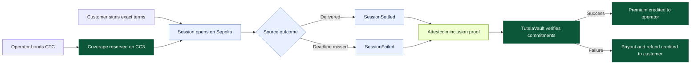
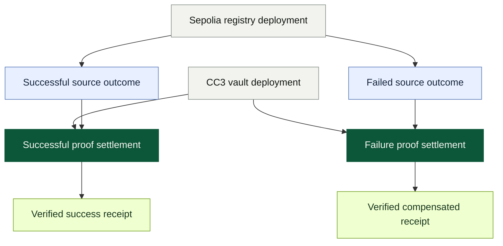

<p align="center">
  
</p>

<h1 align="center">Tutela</h1>
<p align="center"><strong>Proof-settled service warranties for DePIN.</strong></p>
<p align="center">Lock collateral before service. Settle from verified delivery. Pay failure without discretion.</p>

<p align="center">
  <a href="#public-testnet-evidence">Evidence</a> ·
  <a href="#zero-spend-local-demo">Local demo</a> ·
  <a href="#protocol-architecture">Architecture</a> ·
  <a href="#verification">Verification</a> ·
  <a href="SECURITY.md">Security</a>
</p>

Tutela is a public-testnet prototype for collateral-backed service guarantees. An operator bonds native CTC against immutable service terms before a session begins. A source-chain outcome is proven through Attestcoin, and the Creditcoin CC3 vault releases the premium when service is delivered or compensates the customer when it is not.

The prover transports evidence but does not decide the result. `TutelaVault` accepts only proofs whose chain, registry, event, identities, terms, deadline, and service units match the coverage reserved on CC3.

## Protocol at a glance



## Published evidence map



## What this release demonstrates

- One verified successful lifecycle.
- One verified compensated failure lifecycle.
- Two explorer-backed contract deployments.
- Four explorer-backed terminal settlement transactions.
- Six published transaction hashes in total.
- A validated static evidence application with no fabricated pending state.

This release does not claim a larger batch campaign. It is a testnet prototype, uses non-upgradeable contracts, and has not received an independent security audit.

## Public testnet evidence

### Deployments

- **Ethereum Sepolia · `ServiceSessionRegistry`**
  - Address: [`0x6ecA894E12cE5d498e9b55fD4cFc246995494577`](https://sepolia.etherscan.io/address/0x6ecA894E12cE5d498e9b55fD4cFc246995494577)
  - Transaction: [`0xaee94c…4dcf`](https://sepolia.etherscan.io/tx/0xaee94c1d92b383de27fb22ccde9d59a94d0adbb9dc22b86e4545a26cbc544dcf)
  - Block: `11,575,353`
- **Creditcoin CC3 · `TutelaVault`**
  - Address: [`0x6ecA894E12cE5d498e9b55fD4cFc246995494577`](https://creditcoin-testnet.blockscout.com/address/0x6ecA894E12cE5d498e9b55fD4cFc246995494577)
  - Transaction: [`0x5e158d…2dd1`](https://creditcoin-testnet.blockscout.com/tx/0x5e158d6be28f2b20aa532fe2d1ff10a779323efae647bdf2aa11cdb6a1622dd1)
  - Block: `5,380,994`

### Successful service

- Sepolia authority: [`0x660700…6f36`](https://sepolia.etherscan.io/tx/0x660700a12e7c94f1acf0439157beeb6ba1cd935aade75ef6ab7ec3ecc9216f36), block `11,575,967`
- CC3 proof settlement: [`0x12b3d8…f12b`](https://creditcoin-testnet.blockscout.com/tx/0x12b3d8a3d7c666aca28631d3d594443389e69ae15b563f14c916e390242bf12b), block `5,381,500`
- Result: `1` unit delivered, `0.001 CTC` premium credited, reserved bond released
- Coverage: `0x60cf6800840d779b92454f6358445bfe66825cc0af748e562accf5276c30444c`

### Compensated failure

- Sepolia authority: [`0xb34a32…505d`](https://sepolia.etherscan.io/tx/0xb34a32183024e6a7d5276c5b74227343b937ac396a4b55ca23fdbac8e746505d), block `11,576,105`
- CC3 proof settlement: [`0xde0669…cf01`](https://creditcoin-testnet.blockscout.com/tx/0xde066947de440ac2eb140ebf65fe37b459e781eb646012ec74fda60314c7cf01), block `5,381,614`
- Result: `0.01 CTC` bond consumed, `0.011 CTC` credited as payout plus refund
- Coverage: `0xd1c9c247c2aab9ef519b2cceec8ac36121bee6e66e1f8a0d73542b34b18a59ef`

The shared program ID is `0x88c009c1caeaa9b2889593791115138e662f8d6e3e6dea58ff03491037187f07`. The deployed protocol revision recorded by the evidence is `2f86d9637bdae625af813159d288422a0154900c`.

## Zero-spend local demo

The recommended local demo is read-only. It requires no wallet, private key, keystore, funded account, or environment file.

### 1. Check prerequisites

Install Node.js `24+`, pnpm `11.20.0`, and Git.

```powershell
node --version
corepack enable
corepack prepare pnpm@11.20.0 --activate
pnpm --version
```

### 2. Install dependencies

From the repository root:

```powershell
pnpm install --frozen-lockfile
```

### 3. Start the demo

```powershell
pnpm dev
```

Open [http://localhost:5173](http://localhost:5173) and keep the terminal running.

### 4. Present the flow

1. Open `/` for the protocol overview and six-transaction evidence summary.
2. Open `/app` for the evidence dashboard.
3. Open `/app/coverage` to compare the successful and compensated outcomes.
4. Open `/app/activity` for settlement activity.
5. Open the successful receipt at `/receipt/0x60cf6800840d779b92454f6358445bfe66825cc0af748e562accf5276c30444c`.
6. Open the compensated receipt at `/receipt/0xd1c9c247c2aab9ef519b2cceec8ac36121bee6e66e1f8a0d73542b34b18a59ef`.
7. Follow the explorer links to the four terminal settlement transactions and two deployment transactions.
8. Explain that success releases reserved collateral and credits premium, while failure consumes the committed payout and credits the customer.

Useful read-only routes are `/`, `/app`, `/app/programs`, `/app/coverage`, `/app/activity`, and `/receipt/<coverageId>`.

`/app/programs/new` is a real CC3 write flow and is not part of the zero-spend demo.

### Production preview

```powershell
pnpm --filter @tutela/web build
pnpm --filter @tutela/web preview
```

Open [http://localhost:4173](http://localhost:4173).

## Verification

### Fast local checks

These commands require no wallet or chain funds:

```powershell
pnpm format:check
pnpm typecheck
pnpm test
pnpm build
```

### Read-only live validation

These commands use public RPC endpoints but do not sign or spend:

```powershell
pnpm validate:evidence
pnpm validate:deployments
pnpm validate
```

`validate:evidence` discovers every manifest under `evidence/`, checks schema and uniqueness, verifies exact Sepolia and CC3 receipts and events, confirms Attestcoin metadata, and checks historical state and economic effects.

`validate:deployments` rebuilds the contracts and verifies revision provenance, creation input, constructor arguments, receipts, runtime bytecode, and the canonical CC3 verifier.

Public RPC availability is required. Validation fails closed when required chain data is unavailable.

### Full release gate

Contract checks require Foundry `1.7.1`. On a fresh clone, install the pinned test dependency once:

```powershell
forge install foundry-rs/forge-std@v1.16.2 --root contracts --no-git --shallow
git restore -- contracts/foundry.toml
pnpm verify
```

The same release gate runs in GitHub Actions with pinned Node, pnpm, Foundry, and forge-std versions.

## Settlement model

### Service delivered

1. The customer reserves coverage and pays the program premium on CC3.
2. The customer authorizes exact session terms with EIP-712.
3. The authorized device opens and settles the session on Sepolia.
4. A permissionless worker obtains the Attestcoin proof and submits it to CC3.
5. The vault releases reserved collateral and credits the operator premium.

### Service missed

1. Coverage and the source session are opened against the same committed terms.
2. The deadline expires without a valid service receipt.
3. Anyone finalizes the failed source session on Sepolia.
4. A permissionless worker proves the failure event on CC3.
5. The vault consumes the reserved payout and credits the customer with payout plus premium refund.

Workers transport proof. Contracts decide whether a proof authorizes a state transition.

## Protocol architecture

- `ServiceSessionRegistry` manages customer authorization, device-bound opening, signed completion, and deterministic expiry on Sepolia.
- `TutelaVault` manages program terms, native CTC collateral, payout reservation, proof semantics, and pull-payment settlement on CC3.
- The permissionless prover indexes source events, acquires proofs, simulates submissions, retries transient failures, and submits to CC3.
- `packages/protocol` shares ABIs, chain constants, schemas, and evidence types.
- The web application renders manifest-backed coverage views and public receipts.

The contracts are non-upgradeable. There is no proxy administrator, trusted relay role, arbitrary cross-chain executor, protocol token, DAO vote, or AI adjudicator in the settlement path.

## Trust model

Attestcoin proves that a source transaction and receipt were included for the configured chain and block. Tutela additionally requires the authoritative chain key, successful zero-value transaction, approved registry, exact lifecycle event, matching identities and terms, sufficient units for success, valid lifecycle state, and unused proof.

A prover may delay, retry, disappear, or submit invalid data. It cannot grant itself authority or redirect value.

The authorized device still attests the physical service measurement. An EVM receipt cannot independently prove electricity, bandwidth, storage, or compute delivery. Production use requires secure device keys and a hardware trust model beyond this prototype.

For the published testnet evidence, customer, operator, and device roles use one dedicated account. The contract roles and signatures remain distinct, but the evidence does not demonstrate independent custody. See [`SECURITY.md`](SECURITY.md).

> **Testnet only.** Tutela has not received an independent security audit and must not custody production value.

## Operational commands

No environment file is required for the read-only demo. Optional frontend address overrides are `VITE_SOURCE_REGISTRY_ADDRESS` and `VITE_TUTELA_VAULT_ADDRESS`.

The prover is operational software, not a demo command. It loads a signer and can submit CC3 transactions even in `--once` mode:

```powershell
Copy-Item '.env.example' 'apps\prover\.env'
pnpm --filter @tutela/prover start -- --once
```

Use an encrypted Foundry keystore through `CC3_KEYSTORE_PATH`. Never commit or paste a private key, mnemonic, keystore password, or populated `.env` file.

The lifecycle runner is read-only unless reservation is explicitly authorized:

```powershell
.\scripts\live-lifecycle.ps1 -Outcome success
```

The following command spends testnet funds and may continue into additional lifecycle transactions:

```powershell
.\scripts\live-lifecycle.ps1 -Outcome success -ConfirmReservation
```

## Repository layout

- `apps/prover`: permissionless proof worker and durable queue
- `apps/web`: evidence application and optional CC3 write flow
- `contracts/src/source`: Sepolia session authority
- `contracts/src/cc3`: Creditcoin collateral and settlement vault
- `contracts/test`: unit, adversarial, fuzz, and invariant coverage
- `packages/protocol`: shared ABIs, constants, schemas, and types
- `deployments`: explorer-backed deployment manifests
- `evidence`: verified success and failure manifests
- `scripts`: Foundry wrapper, lifecycle runner, and validators

## Evidence discipline

A `pending` manifest contains only schema version, status, and outcome. A `verified` manifest requires complete source and destination records, semantics, balance effects, and deployed contract references.

Validators require exact explorer hosts and hashes, matching protocol revisions, successful receipts, historical program and coverage state, canonical Attestcoin metadata, and exact economic equations. The README and application remain downstream of public, machine-checked facts.

## License

[MIT](LICENSE) · Built for BUIDL CTC 2026.
